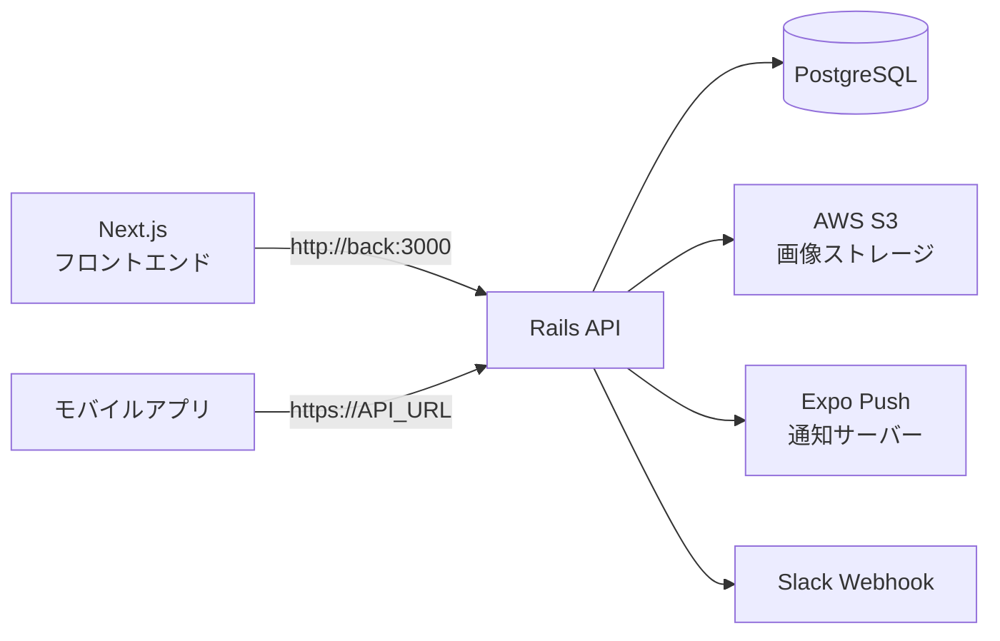
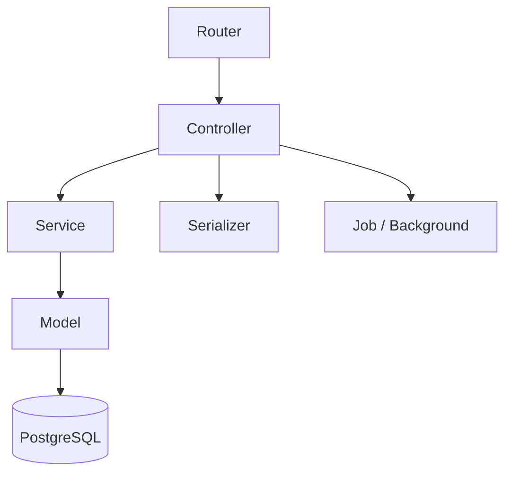

# BUZZ BASE バックエンド

野球の個人成績をランキング形式で共有するWebアプリのバックエンドAPI。Rails 7 + PostgreSQL で構築。

## アーキテクチャ

### システム全体図



### レイヤー構成



- **Controller**: リクエスト処理・レスポンス返却
- **Service**: ビジネスロジック（GoogleAuthService, PushNotificationService等）
- **Serializer**: APIレスポンスのJSON整形（ActiveModelSerializers）
- **Model**: データアクセス・バリデーション・関連
- **Job**: 非同期処理（統計バッチ、通知）

### APIバージョニング

| バージョン | 用途 | ベースパス |
|-----------|------|----------|
| v1 | メインAPI（20+エンドポイント） | `/api/v1/` |
| v2 | ダッシュボード・試合結果（最適化版） | `/api/v2/` |
| Admin | 管理画面用API | `/api/v1/admin/` |

### 認証方式

| 対象 | 方式 | ヘッダー |
|------|------|---------|
| 一般ユーザー | devise_token_auth | `access-token`, `client`, `uid` |
| Google認証 | GoogleAuthService | IDトークン検証（Web/iOS/Android対応） |
| 管理者 | JWT | `Authorization: Bearer <token>` |

### ディレクトリ構成

```
app/
├── controllers/api/
│   ├── v1/                     # メインAPI
│   │   ├── auth/               # 認証（registrations, sessions, google）
│   │   ├── admin/              # 管理画面API
│   │   ├── game_results_controller.rb
│   │   ├── batting_averages_controller.rb
│   │   ├── pitching_results_controller.rb
│   │   ├── groups_controller.rb
│   │   ├── notifications_controller.rb
│   │   ├── seasons_controller.rb
│   │   └── ...
│   └── v2/                     # 最適化版API
│       ├── dashboards_controller.rb
│       └── game_results_controller.rb
├── models/                     # ActiveRecordモデル
├── serializers/                # APIレスポンス整形
│   ├── v2/                     # v2用シリアライザ
│   └── admin/                  # 管理画面用シリアライザ
├── services/                   # ビジネスロジック
│   ├── google_auth_service.rb
│   ├── push_notification_service.rb
│   ├── slack_notification_service.rb
│   ├── internal_jwt_service.rb
│   └── group_ranking_snapshot_service.rb
├── jobs/                       # バックグラウンドジョブ
└── uploaders/                  # CarrierWave（画像アップロード）
config/
├── routes.rb                   # ルーティング定義
├── schedule.rb                 # Cronジョブ設定
└── initializers/
db/
├── migrate/                    # マイグレーション
└── seeds.rb
spec/                           # RSpecテスト
```

## 主要エンドポイント

| カテゴリ | エンドポイント例 | 説明 |
|---------|----------------|------|
| 認証 | `POST /auth/sign_in` | ログイン |
| 認証 | `POST /auth/google` | Googleログイン |
| ユーザー | `GET /users/:id` | ユーザー情報取得 |
| 試合結果 | `GET /game_results` | 試合一覧 |
| 試合結果 | `POST /game_results` | 試合記録作成 |
| 打撃成績 | `GET /batting_averages/personal_data` | 個人打撃成績 |
| 投手成績 | `GET /pitching_results/personal_data` | 個人投手成績 |
| グループ | `GET /groups` | グループ一覧 |
| 通知 | `GET /notifications` | 通知一覧（運営お知らせ含む） |
| シーズン | `GET /seasons` | シーズン一覧 |
| ダッシュボード | `GET /v2/dashboard` | ダッシュボード集約API |

> すべてのエンドポイントは `/api/v1/` または `/api/v2/` プレフィックス付き

## 設計パターン

### Service層

ビジネスロジックはControllerから分離し、`app/services/` に配置する。

```ruby
# 例: Google認証の検証
GoogleAuthService.verify(id_token)
# → { email:, uid:, name: }
```

### Concern

複数のControllerで共通するロジックは `app/controllers/concerns/` に抽出する。

```ruby
# 例: 試合種別の変換ロジック
include MatchTypeConvertible
```

## 開発環境のセットアップ

### 前提条件

- Docker / Docker Compose

### 手順

```bash
# 1. ルートリポジトリをクローン
git clone --recurse-submodules git@github.com:ippei-shimizu/buzzbase.git
cd buzzbase

# 2. 全サービス起動
docker compose up

# 3. DB作成（初回のみ）
docker compose exec back rails db:create db:migrate db:seed

# 4. 動作確認
curl http://localhost:3100/api/v1/users
```

## 開発コマンド

| コマンド | 説明 |
|---------|------|
| `docker compose exec back rails console` | Railsコンソール |
| `docker compose exec back rails db:migrate` | マイグレーション実行 |
| `docker compose exec back rails db:seed` | シードデータ投入 |
| `docker compose exec back bundle exec rspec` | 全テスト実行 |
| `docker compose exec back bundle exec rubocop` | Linter実行 |

## テスト

```bash
# 全テスト
docker compose exec back bundle exec rspec

# 特定ファイル
docker compose exec back bundle exec rspec spec/requests/api/v1/game_results_spec.rb

# モデルテストのみ
docker compose exec back bundle exec rspec spec/models/
```

- RSpec + FactoryBot + Shoulda Matchers
- テストファイルは `spec/` 配下に `requests/`, `models/`, `services/`, `serializers/` で分類

## 環境変数

| 変数名 | 説明 |
|--------|------|
| `DATABASE_URL` | PostgreSQL接続URL |
| `JWT_SECRET` | JWT署名用シークレット |
| `GOOGLE_CLIENT_ID` | Google OAuth（Web） |
| `GOOGLE_IOS_CLIENT_ID` | Google OAuth（iOS） |
| `GOOGLE_ANDROID_CLIENT_ID` | Google OAuth（Android） |
| `AWS_ACCESS_KEY_ID` | S3アクセスキー |
| `AWS_SECRET_ACCESS_KEY` | S3シークレットキー |
| `AWS_BUCKET_NAME` | S3バケット名 |
| `SLACK_WEBHOOK_URL` | Slack通知用Webhook |
| `SENTRY_DSN` | Sentry DSN |

## バッチ処理

| ジョブ | 実行頻度 | 説明 |
|-------|---------|------|
| 日次統計 | 毎日 0:00 JST | ユーザー数・アクティブ率等の集計 |
| 週次統計 | 毎週月曜 0:00 JST | 週間トレンド集計 |
| 月次統計 | 毎月1日 0:00 JST | 月間レポート生成 |
| ランキング更新 | 毎日 | グループランキングスナップショット |

> 詳細: `docs/analytics_batch_processing.md`

## 関連リポジトリ

| リポジトリ | 説明 |
|-----------|------|
| [buzzbase](https://github.com/ippei-shimizu/buzzbase) | ルートリポジトリ（モノレポ） |
| [buzzbase_front](https://github.com/ippei-shimizu/buzzbase_front) | フロントエンド（Next.js） |
| [buzzbase_mobile](https://github.com/ippei-shimizu/buzzbase_mobile) | モバイルアプリ（Expo/React Native） |
